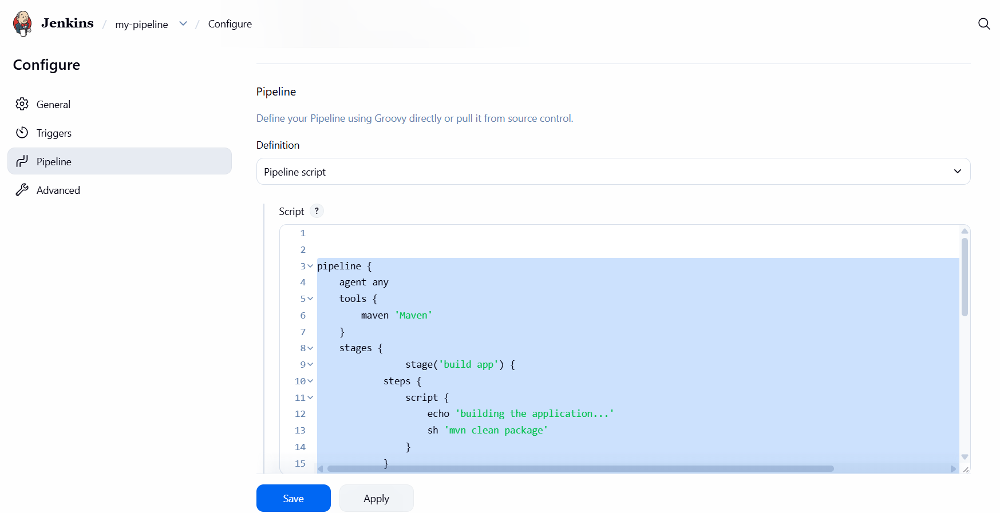

# Jenkins CI/CD Pipeline with Maven 3.9 and Docker

## Project Overview

This project demonstrates the creation and execution of a multi-stage Jenkins CI/CD Pipeline that automates Java application packaging, Docker image creation, Docker Hub authentication, and container image publishing.

The project represents a progression from Jenkins Freestyle jobs into a structured Pipeline workflow where multiple stages of the software delivery process are defined and executed as a single automated process.

The completed pipeline includes:

- Maven 3.9 application build and packaging
- Multi-stage Jenkins Pipeline execution
- Docker image creation
- Jenkins-managed Docker Hub credentials
- Secure Docker registry authentication
- Automated Docker image publishing
- Pipeline execution validation
- External verification of the published container image

The Jenkins environment used for this project runs as a Docker container on a DigitalOcean Ubuntu server.

---

## Business Context

Modern software teams need reliable and repeatable processes for transforming application source code into deployable software.

Manually building applications, creating container images, authenticating with registries, and publishing images introduces unnecessary operational effort and increases the possibility of inconsistent builds.

CI/CD platforms such as Jenkins automate these activities.

This project demonstrates how Jenkins can coordinate Maven and Docker operations through a multi-stage Pipeline, allowing application builds and container publishing to execute as part of a single automated workflow.

---

## Technologies

- Jenkins
- Jenkins Pipeline
- Maven 3.9
- Java
- Docker
- Docker Hub
- Jenkins Credentials
- Groovy
- Linux
- DigitalOcean
- Git
- GitHub
- CI/CD

---

# Pipeline Architecture

```text
                  Jenkins Pipeline
                         |
                         v
                +----------------+
                |   Build App    |
                +-------+--------+
                        |
                        v
                mvn clean package
                        |
                        v
                +----------------+
                |  Build Image   |
                +-------+--------+
                        |
                        v
                   docker build
                        |
                        v
               Jenkins Credentials
                        |
                        v
                  Docker Login
                        |
                        v
                   docker push
                        |
                        v
                    Docker Hub
                        |
                        v
               Published Container
                     Image
                        |
                        v
                +----------------+
                |     Deploy     |
                +-------+--------+
                        |
                        v
                   Placeholder
```

---

# Jenkins Pipeline Creation

A new Jenkins Pipeline item was created and named:

```text
my-pipeline
```

Unlike the previous Jenkins Freestyle workflow, this project defines multiple stages within a Jenkins Pipeline script.

The Pipeline contains three primary stages:

```text
build app
build image
deploy
```



---

# Pipeline Configuration

The Jenkins Pipeline used for this project is represented in the repository as:

```text
Jenkinsfile
```

The Pipeline uses Jenkins Declarative Pipeline syntax.

```groovy
pipeline {
    agent any

    tools {
        maven 'maven-3.9'
    }

    stages {
        stage('build app') {
            steps {
                script {
                    echo 'building the application...'
                    sh 'mvn clean package'
                }
            }
        }

        stage('build image') {
            steps {
                script {
                    echo "building the docker image..."

                    withCredentials([
                        usernamePassword(
                            credentialsId: 'docker-hub-repo',
                            passwordVariable: 'PASS',
                            usernameVariable: 'USER'
                        )
                    ]) {
                        sh "docker build -t ejones904/demo-app:jma2.0 ."
                        sh 'echo $PASS | docker login -u $USER --password-stdin'
                        sh "docker push ejones904/demo-app:jma2.0"
                    }
                }
            }
        }

        stage('deploy') {
            steps {
                script {
                    echo 'deploying docker image...'
                }
            }
        }
    }
}
```

---

# Stage 1 — Build Application

The first Pipeline stage is:

```text
build app
```

This stage executes:

```bash
mvn clean package
```

using the Jenkins-managed Maven 3.9 installation configured as:

```text
maven-3.9
```

The Pipeline declares this tool using:

```groovy
tools {
    maven 'maven-3.9'
}
```

The build stage:

1. Starts with a clean Maven build environment.
2. Resolves the required Maven dependencies.
3. Compiles the Java application.
4. Executes the Maven build lifecycle.
5. Packages the application.

The stage is defined as:

```groovy
stage('build app') {
    steps {
        script {
            echo 'building the application...'
            sh 'mvn clean package'
        }
    }
}
```

This allows Jenkins to automatically prepare the Java application before containerization.

---

# Stage 2 — Build Docker Image

After the Maven build completes, Jenkins proceeds to:

```text
build image
```

The Pipeline creates a Docker image using:

```bash
docker build -t ejones904/demo-app:jma2.0 .
```

The resulting container image is tagged:

```text
ejones904/demo-app:jma2.0
```

This identifies the Docker Hub repository and the image tag produced by this Pipeline execution.

---

# Jenkins Credential Management

Publishing the image requires Jenkins to authenticate with Docker Hub.

Rather than storing Docker Hub authentication information directly inside the Pipeline, the credentials were configured through Jenkins.

The credential is referenced using the credential ID:

```text
docker-hub-repo
```

The Pipeline accesses the credential using:

```groovy
withCredentials([
    usernamePassword(
        credentialsId: 'docker-hub-repo',
        passwordVariable: 'PASS',
        usernameVariable: 'USER'
    )
])
```

Jenkins temporarily makes the credential available during Pipeline execution through:

```text
USER
PASS
```

The Pipeline then authenticates with Docker Hub using:

```bash
echo $PASS | docker login -u $USER --password-stdin
```

Using `--password-stdin` prevents the Docker Hub password from being passed directly as a command-line password argument.

> No Docker Hub passwords, tokens, or other authentication secrets are stored in this repository.

---

# Docker Image Publishing

After successfully authenticating with Docker Hub, Jenkins executes:

```bash
docker push ejones904/demo-app:jma2.0
```

This publishes the image created by the Pipeline to the remote Docker Hub container registry.

The automated workflow is:

```text
Java Application
       |
       v
Maven 3.9
       |
       v
mvn clean package
       |
       v
Docker Build
       |
       v
ejones904/demo-app:jma2.0
       |
       v
Jenkins Credentials
       |
       v
Docker Hub Login
       |
       v
Docker Push
       |
       v
Docker Hub
```

---

# Stage 3 — Deploy

The final Pipeline stage is:

```text
deploy
```

The current implementation contains:

```groovy
stage('deploy') {
    steps {
        script {
            echo 'deploying docker image...'
        }
    }
}
```

At this stage of the project, the deployment stage is intentionally a placeholder.

The Pipeline currently automates the application build, container image creation, Docker Hub authentication, and image publishing portions of the CI/CD process.

Future development can extend this stage to deploy the generated container image to a target environment.

---

# Successful Pipeline Execution

The documented successful Pipeline execution occurred during:

```text
Build #7
```

Jenkins successfully executed all three configured stages.


The complete Jenkins Console Output was preserved:

[Build #7 Console Output](build-logs/build-07-success-console-output.txt)

---

# Build #7 Execution Flow

The successful build followed this sequence:

```text
START
  |
  v
Jenkins Pipeline
  |
  v
build app
  |
  v
Maven 3.9
  |
  v
mvn clean package
  |
  v
Application Packaged
  |
  v
build image
  |
  v
docker build
  |
  v
ejones904/demo-app:jma2.0
  |
  v
Load Jenkins Credentials
  |
  v
Docker Hub Authentication
  |
  v
docker push
  |
  v
Docker Hub
  |
  v
deploy
  |
  v
Deployment Placeholder
  |
  v
SUCCESS
```

---

# Docker Hub Validation

After Build #7 completed successfully, Docker Hub was inspected to verify the external result of the Pipeline.

The container image:

```text
ejones904/demo-app:jma2.0
```

was successfully available in the Docker Hub repository.


This provides external validation that the Pipeline successfully completed the container publishing process.

```text
Jenkins
   |
   | docker push
   v
Docker Hub
   |
   v
ejones904/demo-app:jma2.0
```

---

# Project Validation

The Pipeline was validated at multiple levels.

## Application Build

Jenkins successfully executed:

```bash
mvn clean package
```

using Maven 3.9, confirming that the application could be built and packaged through the Pipeline.

## Container Build

Jenkins successfully executed:

```bash
docker build -t ejones904/demo-app:jma2.0 .
```

confirming that the application could be packaged into a Docker image.

## Registry Authentication

Jenkins successfully authenticated with Docker Hub using Jenkins-managed credentials.

## Registry Publishing

Jenkins successfully executed:

```bash
docker push ejones904/demo-app:jma2.0
```

## External Validation

Docker Hub was inspected and the resulting `jma2.0` image was confirmed in the remote repository.

Together, these checks validated the implemented workflow rather than relying only on the Jenkins `SUCCESS` status.

---

# Security Considerations

Credential management is an important component of CI/CD automation.

This project uses Jenkins-managed credentials rather than hard-coding Docker Hub authentication information directly into the Pipeline.

Security practices demonstrated include:

- Docker Hub credentials stored in Jenkins
- Credentials referenced through a Jenkins credential ID
- Temporary credential injection during Pipeline execution
- Docker authentication using `--password-stdin`
- No passwords stored in the Jenkinsfile
- No passwords stored in GitHub
- No authentication secrets intentionally exposed in screenshots
- No authentication secrets intentionally exposed in preserved build logs

A production environment could further improve security through:

- Scoped Docker Hub access tokens
- Credential rotation
- Least-privilege registry permissions
- Restricted Jenkins administrative access
- Dedicated Jenkins build agents
- HTTPS/TLS
- Centralized secrets management
- Network segmentation
- Build environment isolation

---

# Freestyle Jobs vs Jenkins Pipeline

This project represents a progression from Jenkins Freestyle jobs into Pipeline-based CI/CD automation.

A Freestyle job allows individual build actions to be configured primarily through the Jenkins user interface.

A Jenkins Pipeline allows multiple stages of the CI/CD workflow to be defined together as code.

```text
Freestyle Job
     |
     v
GUI-configured
build steps

       VS

Jenkins Pipeline
     |
     v
Structured multi-stage
CI/CD workflow
```

This provides a foundation for Pipeline as Code, where CI/CD definitions can ultimately be version controlled alongside application source code.

---

# Key Achievements

- Created and configured a Jenkins Pipeline project.
- Defined a multi-stage CI/CD workflow.
- Configured Jenkins to use Maven 3.9.
- Automated Java application building and packaging.
- Automated Docker image creation.
- Created the `ejones904/demo-app:jma2.0` container image.
- Integrated Jenkins-managed Docker Hub credentials.
- Authenticated with Docker Hub during Pipeline execution.
- Automated Docker image publishing to Docker Hub.
- Successfully completed Jenkins Build #7.
- Verified the resulting image directly in Docker Hub.
- Preserved Jenkins Console Output as technical build evidence.
- Separated application build, container creation, and deployment into distinct Pipeline stages.
- Established a deployment stage for future automation.

---

# Skills Demonstrated

- Jenkins
- Jenkins Pipeline
- CI/CD
- Pipeline Automation
- Groovy
- Maven 3.9
- Java
- Docker
- Docker Hub
- Docker Image Management
- Container Registries
- Jenkins Credentials
- Credential Management
- Build Automation
- Application Packaging
- Containerization
- Linux
- DigitalOcean
- Git
- GitHub
- Technical Documentation

---

# Build Evidence

The complete Console Output from the documented successful Pipeline execution is included:

```text
build-logs/
└── build-07-success-console-output.txt
```

The build log provides technical evidence of the successful Pipeline execution and associated build operations.

---

# Screenshots

| Screenshot | Description |
|---|---|
| `01-jenkins-pipeline-script.png` | Jenkins Pipeline configuration and Pipeline script |
| `02-successful-pipeline-stages.png` | Successful Jenkins Build #7 and Pipeline stages |
| `03-docker-hub-pipeline-image.png` | `jma2.0` container image successfully published to Docker Hub |

---

# Repository Structure

```text
jenkins-cicd-pipeline/
│
├── Jenkinsfile
├── README.md
├── .gitignore
│
├── build-logs/
│   └── build-07-success-console-output.txt
│
└── screenshots/
    ├── 01-jenkins-pipeline-script.png
    ├── 02-successful-pipeline-stages.png
    └── 03-docker-hub-pipeline-image.png
```

---

# Future Improvements

The current Pipeline automates the application build and container publishing stages of the CI/CD lifecycle.

Future improvements could include:

- Execute the Pipeline directly from SCM
- Trigger Jenkins automatically from source-control changes
- Implement dynamic Docker image versioning
- Publish Maven artifacts to Nexus
- Publish container images to a private registry
- Add automated test reporting
- Add code-quality checks
- Add container vulnerability scanning
- Implement an actual deployment target
- Create development, staging, and production environments
- Add approval gates
- Add build notifications
- Implement rollback procedures
- Introduce Jenkins build agents
- Provision deployment infrastructure using Infrastructure as Code

A logical next step would be configuring Jenkins to retrieve and execute the version-controlled `Jenkinsfile` directly from the application's source repository.

---

## Author

**Ethan Jones**

Cloud & DevOps Portfolio
