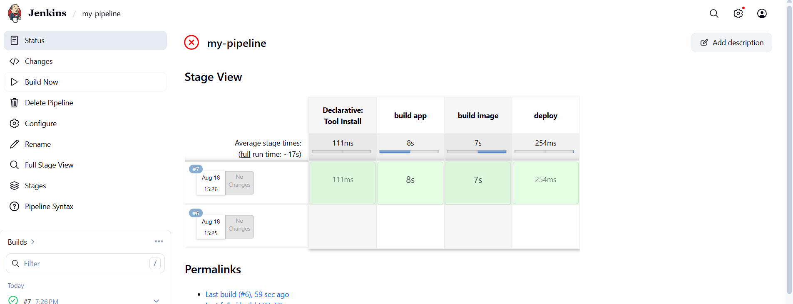
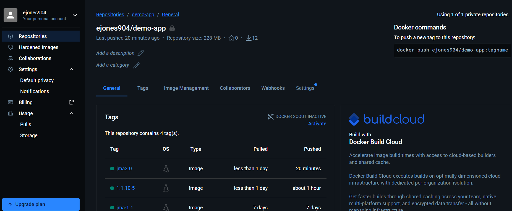

# Jenkins CI/CD Pipeline with Maven and Docker

A multi-stage Jenkins CI/CD pipeline that automates Java application packaging, Docker image creation, authenticated Docker Hub access, and container image publishing.

The project demonstrates the progression from manually configured Jenkins jobs into a structured pipeline workflow where multiple software delivery stages execute as a single automated process.

---

## Project Overview

The objective was to automate the build and container publishing portions of the application delivery lifecycle.

The implemented workflow includes:

* Maven 3.9 application build
* Jenkins Pipeline execution
* Docker image creation
* Jenkins-managed Docker Hub credentials
* secure registry authentication
* automated Docker image publishing
* pipeline validation
* external Docker Hub verification

The Jenkins environment used for this project runs as a Docker container on a DigitalOcean Ubuntu server.

The deployment stage currently exists as a placeholder and does not perform an actual application deployment.

---

## Architecture

```text
Application Source
       |
       v
 Jenkins Pipeline
       |
       v
  Maven Build
       |
       v
 Application JAR
       |
       v
 Docker Build
       |
       v
Container Image
       |
       v
Jenkins Credentials
       |
       v
 Docker Hub Login
       |
       v
  Docker Push
       |
       v
   Docker Hub
```

---

## Technology Stack

| Technology          | Purpose                         |
| ------------------- | ------------------------------- |
| Jenkins             | CI/CD orchestration             |
| Jenkins Pipeline    | Multi-stage workflow definition |
| Maven 3.9           | Java build and packaging        |
| Java                | Application runtime             |
| Docker              | Container image creation        |
| Docker Hub          | Container registry              |
| Jenkins Credentials | Registry credential management  |
| Groovy              | Pipeline syntax                 |
| Linux               | Jenkins host environment        |
| DigitalOcean        | Jenkins infrastructure          |
| Git / GitHub        | Source control                  |

---

## Engineering Decisions

### Pipeline-Based Automation

The project moved beyond Jenkins Freestyle jobs into a structured Pipeline workflow.

Instead of configuring isolated build steps manually through the Jenkins UI, the delivery process was separated into logical stages:

```text
Build Application
       ↓
Build Container Image
       ↓
Publish Container Image
       ↓
Deployment Placeholder
```

This creates a foundation for Pipeline as Code and more advanced CI/CD workflows.

---

### Build Before Containerization

The Java application is packaged before Docker builds the container image.

The Maven stage executes:

```bash
mvn clean package
```

This ensures that the Docker image is created from a newly generated application artifact rather than depending on an unknown existing build.

---

### Jenkins-Managed Credentials

Docker Hub authentication information is not hard-coded into the pipeline.

Jenkins references the configured credential:

```text
docker-hub-repo
```

and exposes the username and password only while the relevant pipeline steps are executing.

Authentication uses:

```bash
echo $PASS | docker login -u $USER --password-stdin
```

This avoids placing the password directly in the Docker login command or storing it in GitHub.

---

### External Validation

A Jenkins `SUCCESS` status alone was not treated as proof that the workflow completed correctly.

After pipeline execution, Docker Hub was independently inspected to verify that the expected container image had actually been published.

---

## Pipeline Workflow

The implemented pipeline contains three stages.

### 1. Build Application

Jenkins uses the configured Maven 3.9 installation to execute:

```bash
mvn clean package
```

This compiles and packages the Java application.

---

### 2. Build and Publish Docker Image

After the Maven build succeeds, Jenkins creates the container image:

```bash
docker build -t ejones904/demo-app:jma2.0 .
```

The pipeline then authenticates to Docker Hub using Jenkins-managed credentials and publishes the image:

```bash
docker push ejones904/demo-app:jma2.0
```

The resulting image is:

```text
ejones904/demo-app:jma2.0
```

---

### 3. Deploy

The pipeline includes a deployment stage:

```groovy
stage('deploy') {
    steps {
        script {
            echo 'deploying docker image...'
        }
    }
}
```

This stage is intentionally a placeholder in this project.

The implemented automation stops after successfully publishing the Docker image.

Actual remote deployment is handled in later portfolio projects.

---

## Pipeline Execution

The documented successful execution occurred during:

```text
Build #7
```

The pipeline successfully progressed through all configured stages.



The complete console output is preserved at:

```text
build-logs/build-07-success-console-output.txt
```

Detailed implementation steps are preserved in [`IMPLEMENTATION.md`](IMPLEMENTATION.md).

---

## Validation

The workflow was validated at several layers.

### Application Build

Jenkins successfully executed:

```bash
mvn clean package
```

confirming that the Java application could be built and packaged through the pipeline.

---

### Container Build

Jenkins successfully created:

```text
ejones904/demo-app:jma2.0
```

using Docker.

---

### Registry Authentication

Docker Hub authentication completed using credentials stored and injected by Jenkins.

No registry password was stored directly in the pipeline source.

---

### Container Publishing

Jenkins successfully pushed the image to Docker Hub.

The resulting image was then independently verified in the remote registry.



This validates the implemented delivery path:

```text
Application
    ↓
Maven Build
    ↓
Docker Build
    ↓
Authenticated Push
    ↓
Docker Hub
```

---

## Pipeline Configuration

The workflow is represented in the repository through the `Jenkinsfile`.

The primary structure is:

```groovy
pipeline {
    agent any

    tools {
        maven 'maven-3.9'
    }

    stages {
        stage('build app') {
            steps {
                sh 'mvn clean package'
            }
        }

        stage('build image') {
            steps {
                // Docker build, authentication, and push
            }
        }

        stage('deploy') {
            steps {
                // Deployment placeholder
            }
        }
    }
}
```

This separates the build lifecycle into clear stages and establishes the structure needed for future deployment automation.

---

## Security Considerations

Security practices implemented in this project include:

* Docker Hub credentials stored in Jenkins
* credential references instead of hard-coded secrets
* temporary credential injection during execution
* Docker authentication using `--password-stdin`
* no Docker Hub passwords stored in the repository
* no authentication secrets intentionally included in screenshots or build logs

For a production implementation, additional controls would include:

* scoped registry access tokens
* credential rotation
* least-privilege registry permissions
* dedicated Jenkins agents
* restricted Jenkins administrative access
* centralized secrets management
* TLS
* network segmentation
* isolated build environments

---

## Operational Considerations

The pipeline currently uses a fixed Docker image tag:

```text
jma2.0
```

This is appropriate for demonstrating the publishing workflow but would not provide sufficient artifact traceability for a mature CI/CD system.

A stronger implementation would generate unique image versions using values such as:

```text
Application Version
+
Jenkins Build Number
```

That improvement is incorporated into later pipeline work.

---

## What This Project Demonstrates

This project demonstrates practical experience with:

* Jenkins Pipeline
* CI/CD workflow design
* Maven automation
* Java application packaging
* Docker image creation
* Docker Hub
* container registry authentication
* Jenkins credential management
* Groovy pipeline syntax
* build validation
* artifact publishing
* Linux-hosted Jenkins infrastructure
* pipeline stage separation

---

## Relationship to Other Projects

This project represents an intermediate step in a larger progression:

```text
Manual Application Deployment
          ↓
Jenkins Freestyle Job
          ↓
Jenkins CI/CD Pipeline
          ↓
Pipeline as Code
          ↓
Shared Libraries
          ↓
Multibranch CI/CD
          ↓
Automated AWS Deployment
```

The focus of this repository is specifically the **automated build and container publishing workflow**.

Later projects extend this foundation into source-controlled pipelines, reusable Jenkins functions, multibranch execution, and AWS EC2 deployment.

---

## Current Limitations

The current implementation does not yet include:

* actual application deployment
* dynamic image versioning
* automated source-control triggers
* test reporting
* vulnerability scanning
* approval gates
* rollback
* multiple environments
* infrastructure provisioning

These limitations are intentionally documented rather than presenting the pipeline as a complete production CI/CD solution.

---

## Future Enhancements

Potential improvements include:

* execute the Jenkinsfile directly from SCM
* automated source-control triggers
* dynamic Docker image versioning
* Nexus artifact publishing
* automated tests
* code-quality checks
* container vulnerability scanning
* actual application deployment
* development, staging, and production environments
* approval gates
* build notifications
* rollback procedures
* Jenkins build agents
* Infrastructure as Code

---

## Repository Documentation

* [`README.md`](README.md) — engineering overview and pipeline design
* [`IMPLEMENTATION.md`](IMPLEMENTATION.md) — detailed chronological implementation record
* `build-logs/build-07-success-console-output.txt` — preserved successful build evidence

---

## Engineering Outcome

This project converted several manual application-delivery activities into a single Jenkins-controlled workflow.

The pipeline successfully automated:

```text
Java Build
   ↓
Application Packaging
   ↓
Docker Image Creation
   ↓
Registry Authentication
   ↓
Docker Image Publishing
```

The result established the foundation for the more advanced CI/CD work that followed, while keeping the boundaries of the current implementation clear: the image publishing workflow is automated, but actual deployment is not yet implemented in this repository.
